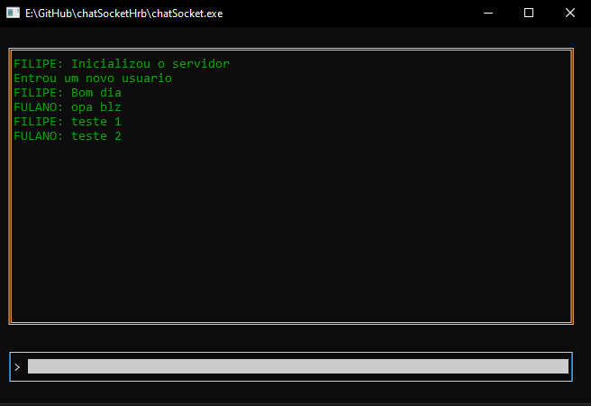

# chatSocketHrb
Afim de exemplificar algumas rotinas nativar da compilação Harbour (xBase) para comunicação socket TCP/IP, foi desenvolvido um Chat multi usuarios direto no console, onde um dos usuários deverá entrar como Servidor e o restante entrará como Clientes utilizando o IP da maquina que ficou como servidor. A porta foi deixada como default a 2002.<br>



## Rotinas nativas para comunicação Socket em Harbour 

```
HB_INetInit()
HB_InetServer(...)
HB_InetConnectIP(...)
HB_InetTimeout(...)
HB_InetAccept(...)
HB_inetCRLF()
HB_inetSend(...)
HB_inetDataReady(...)
HB_inetRecv(...)
```

Para controlar as conexões foi criado uma Thred (`HB_ThreadStart(...)`) para ficar escutando a porta e escrevendo as conversas do chat conforme forem sendo recebidas, assim na compilação deverá ser utilizado o parametro de compilação Multithread.<br>

Para maiores informações utilizar a [Documentação do Harbour][1]<br>

## Compilação
Uma vez que estiver com o [Pacote Harbour][2] instalado na maquina, deverá ser adicionado alguns caminhos a variavel de ambiente `PATH` ou utilizar o script abaixo para inicializar o console. Também definir a variavel `HB_COMPILER` responsavel pos estabelecer o compilador C.<br>

Arquivo: **cfg_console.bat**
```cmd
@echo off
mode 80,25
set path=C:\hb32\bin;C:\hb32\comp\mingw\bin;%path%
set HB_COMPILER=mingw
cd\
%SystemRoot%\system32\cmd.exe
```

Linha de comando para compilação
```cmd
hbmk2 chatSocket.prg -mt -rebuild
```
|Parametro|Motivo|
|-|-|
|-mt|Compilar com Multithread|
|-rebuild|Realizar o rebuild do projeto|

[1]:https://harbour.github.io/doc/index.html
[2]:https://sourceforge.net/projects/harbour-project/files/